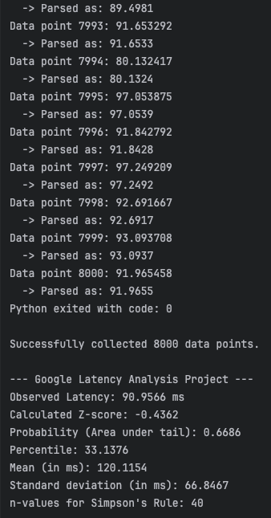
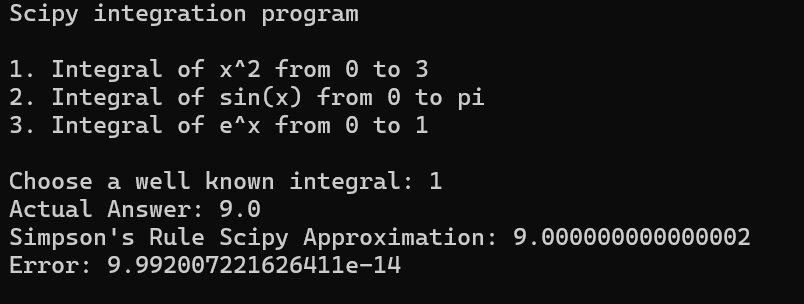
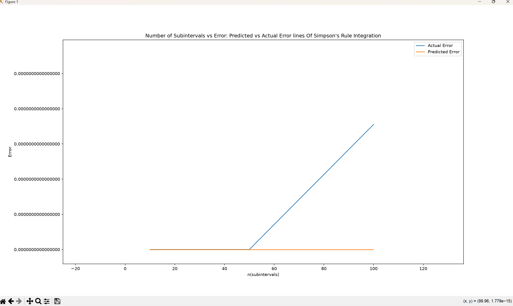
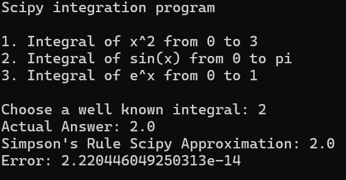
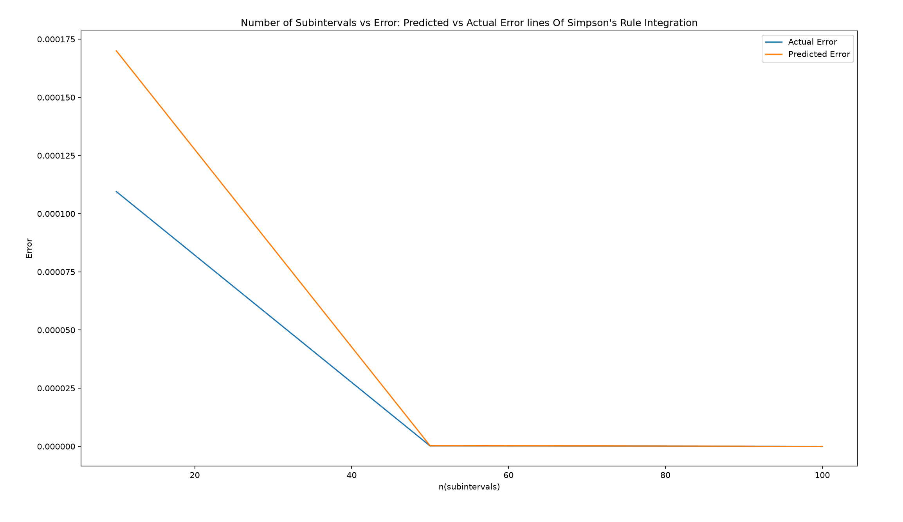
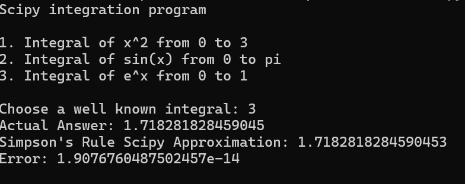
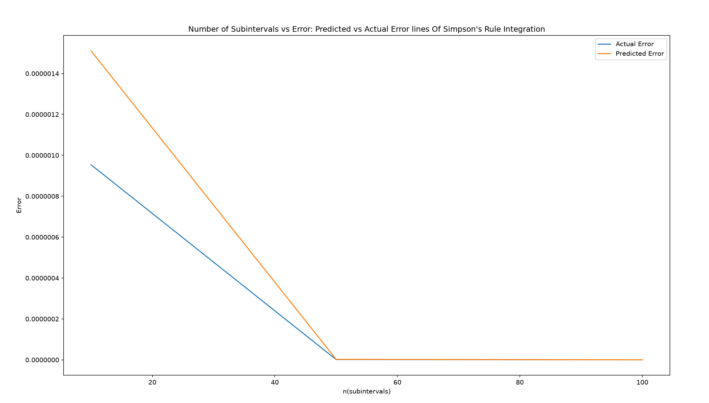

# firstTTFBCompared

A lightweight collaborative latency-analysis project that measures Time To First Byte (TTFB) with Python and analyzes tail-risk probability in C++ using Simpson's Rule.

## Demo / Screenshot


## Project Overview
This project started as a collaborative exploration of networking telemetry using math.(I plan to independently benchmark and validate as well as export csv, etc.) It collects TTFB samples from repeated HTTP requests and then models latency behavior with a normal-distribution approximation.

**What is TTFB?**
Time To First Byte (TTFB) is the time from request start until the first response byte arrives. It is a indicator of network and server responsiveness because it captures connection setup, routing, and initial backend latency.

**Why it matters:**
- Helps detect changes in perceived responsiveness.
- Supports data-driven comparisons across runs and environments.

The C++ side computes summary statistics (mean and standard deviation) and estimates tail probability using Simpson's Rule with a dynamic error-bound step calculation. Python is used for data collection.

## Key Features
- Accurate first-byte timing collection via Python `requests` with streaming enabled.
- Timeout/connection-error handling.
- Cross-language workflow: Python collector output used by a C++ analyzer.
- Mean and standard deviation calculation from acquired dataset.
- Tail-area probability estimation with Simpson's Rule and even-step correction.
- CSV Logging using C++ fstream library for further analysis.

### Prerequisites
- Python 3.9+
- `pip install requests`
- `pip install matplotlib`
- `pip install scipy`
  
- C++17-capable compiler
  - Windows: MSVC (`cl`) or MinGW/GCC (`g++`)
  - Linux/macOS: `g++`


### Run collector only (Python)

```bash
python module1.py
```

Expected output shape (one TTFB value per line):

```text
108.233519
95.883201
TIMEOUT
101.442307
```

> : Current code includes Windows-specific calls (`_popen`, `_pclose`, `_getcwd`, `<direct.h>`). For native Linux/macOS builds, switch those calls to `popen`, `pclose`, `getcwd` (or build under Windows/WSL with compatible changes).

### Timeout and target URL workflow
Current script uses a fixed timeout (`timeout=10`) and URL (`https://www.google.com`) in `module1.py`. Edit those values directly for experiments.

## Architecture and Design

### Simpson's Rule and error control
- Integration target: probability mass from observed maximum latency to a high-tail bound (`mean + 5*stddev`).
- Step selection: `errorBoundFormula(...)` computes `n` from an error tolerance term and ensures `n` is even (required by Simpson's Rule).
- Result: approximate tail probability and derived percentile.

### Where to change parameters
- Sample count input: prompt in `server latency.cpp` and command arg in `module1.py`.
- Request timeout + URL: `module1.py` request config.
- Numerical tolerance behavior: `errorBoundFormula(...)` in `latency_monitor.cpp`.

## Simpson's Rule Error Margins
I compared the error margins of Simpson's rule with varying subintervals against scipy's quad() integration function for well known integrals (x^2, sin(x), and e^x) and graphed the predicted error (k(b-a)^5)/(180n^4)

#### x^2



#### sin(x)



#### e^x




## Data Format and Telemetry
Current collector emits one measurement per line as a numeric value:

```text
dataPointNumber-ttfb(ms)
```

Example:

```text
102.445901
99.553112
110.229044
```

## Coming soon
* Numerical Method Comparisons: Simpson's rule vs Trapezoidal Rule
* Descriptions of tradeoffs between methods
* Testing program on multiple servers
* Measure data pipe overhead


## License and Authors
- **License:** MIT
- **Author:** Anna Gerges
- **Contributors:** Anna Gerges, Nico (collaborator on the original class project)
